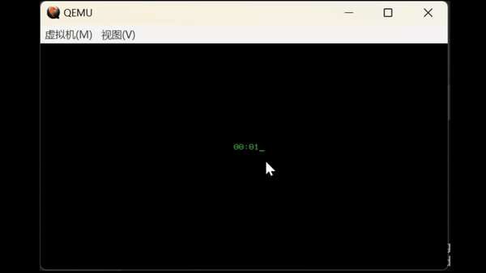

# Digital-Timer-in-Assembly
Write .asm files using assembly language. By modifying the interrupt vector table and setting the 8253/4 timer chip, the time is output every second.

使用汇编语言编写.asm文件。通过修改中断向量表和设置8253/4定时器芯片来实现每隔一秒输出一次时间。

